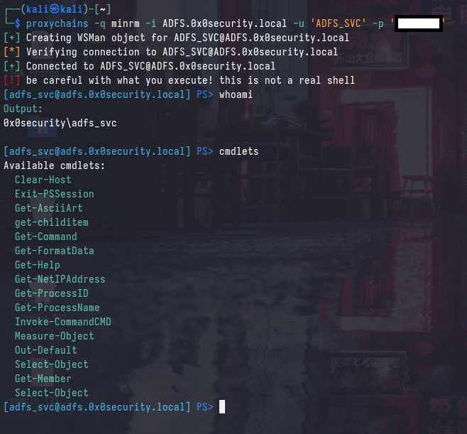

# minrm - a minimalistic winrm client



a minimalistic winrm client written in python using the [pypsrp](https://github.com/jborean93/pypsrp) library, designed to interact with machines running [Just Enough Administration (JEA)](https://learn.microsoft.com/en-us/powershell/scripting/security/remoting/jea/overview?view=powershell-7.5) - with reference to [evil-jea](https://github.com/sashathomas/evil-jea).

## Usage

```bash
minrm -h

minrm -i 'test.domain.local' -u 'Administrator' -p 'Password'
minrm -i '192.168.20.15' -u 'Administrator' -p 'Password'
minrm -i 'test.domain.local' -u 'Administrator' -H 'a4f49c406510bdcab6824ee7c30fd852'

# across forests
minrm -i 'test.domain.local' -u 'Administrator@contoso.local' -p 'Password'
minrm -i 'test.domain.local' -u 'Administrator@contoso.local' -H 'a4f49c406510bdcab6824ee7c30fd852'
```

## Installation

```bash
git clone https://github.com/gatariee/minrm
cd minrm
pipx ensurepath
pipx install .
```

## Initialization

minrm initializes itself (and also sanity-checks connection) by running a `Get-Command` command on the remote machine. this is done to cache all available cmdlets, which can be accessed via the `cmdlets` command. it is _unlikely_ that any JEA policy restricts the use of `Get-Command`.

```bash
┌──(kali㉿kali)-[~/git/minrm]
└─$ proxychains -q minrm -i 'ADFS.0x0security.local' -u 'ADFS_SVC' -p '...' 
[+] Creating WSMan object for ADFS_SVC@ADFS.0x0security.local

# Get-Command
[*] Verifying connection to ADFS_SVC@ADFS.0x0security.local

[+] Connected to ADFS_SVC@ADFS.0x0security.local
[!] be careful with what you execute! this is not a real shell

# nothing is executed on the remote machine!
[adfs_svc@adfs.0x0security.local] PS> cmdlets
Available cmdlets:
  Clear-Host
  Exit-PSSession
  Get-AsciiArt
  get-childitem
  Get-Command
  Get-FormatData
  Get-Help
  Get-NetIPAddress
  Get-ProcessID
  Get-ProcessName
  Invoke-CommandCMD
  Measure-Object
  Out-Default
  Select-Object
  Get-Member
  Select-Object

# nothing is executed on the remote machine!
[adfs_svc@adfs.0x0security.local] PS> info Get-AsciiArt
Name: Get-AsciiArt
Definition: 
    param([string]$type='coffee')
$coffeebreak=@"
         {
      {   }
       }_{ __{
    .-{   }   }-.
   (   }     {   )
   |`-.._____..-'|
   |             ;--.
   |            (__  \
   |             | )  )
   |             |/  /
   |             /  /   
   |            (  /
   \             y'
    `-.._____..-'
"@
...

[adfs_svc@adfs.0x0security.local] PS> whoami
Output:                  
0x0security\adfs_svc                    
```


I found myself heavily relying on [evil-winrm](https://github.com/Hackplayers/evil-winrm) for interacting with machines via WinRM. however, I very quickly found the tool struggling when it came to connecting to machines with [Just Enough Administration (JEA)](https://learn.microsoft.com/en-us/powershell/scripting/security/remoting/jea/overview?view=powershell-7.5) enabled.


```
Info: Establishing connection to remote endpoint
*Evil-WinRM* PS The term 'Invoke-Expression' is not recognized as the name of a cmdlet, function, script file, or operable program. Check the spelling of the name, or if a path was included, verify that the path is correct and try again.    + CategoryInfo          : ObjectNotFound: (Invoke-Expression:String) [], CommandNotFoundException    + FullyQualifiedErrorId : CommandNotFoundException> 
```

This occurs due to the fact that `evil-winrm` runs some commands under the hood to prettify the shell (as well as obtain the present working directory). This is not possible when JEA is enabled as the user is restricted to a subset of commands.

```ruby
until command == 'exit' do
pwd = shell.run('(get-location).path').output.strip
if $colors_enabled
    command = Readline.readline( "#{colorize('*Evil-WinRM*', 'red')}#{colorize(' PS ', 'yellow')}#{pwd}> ", true)
else
    command = Readline.readline("*Evil-WinRM* PS #{pwd}> ", true)
end
$logger&.info("*Evil-WinRM* PS #{pwd} > #{command}")
```